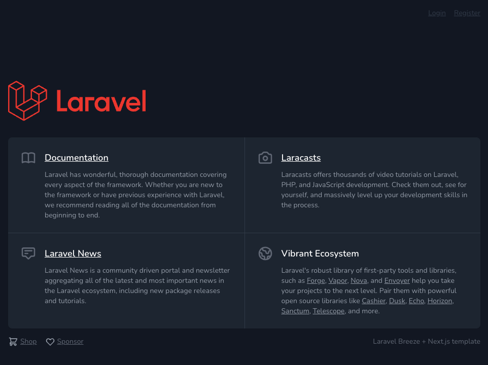

# Set Up a Laravel Backend and Next.js Frontend Development Environment with Docker within 5 minutes

This guide walks you through creating a Laravel backend and a Next.js frontend, all within a Dockerized environment. You can have everything up and running in just a few minutes.

---

## Prerequisites

- **Docker** and **Docker Compose** installed on your system  
- Basic knowledge of **Laravel** and **Next.js**
- Basic knowledge of command-line usage
---

## 1. Clone the Repository

```bash
git clone https://github.com/softjapan/laravel-nextjs-dev-environment.git
```

---

## 2. Create the Laravel Backend

By default, this setup uses MySQL. We will skip running migrations at this point and do them later. Other options use default settings.

```bash
cd laravel-nextjs-dev-environment
docker run --rm -it -v "$PWD:/app" softjpn/laravel-nodejs-dev laravel new laravel-backend
```

---

## 3. Install Laravel Breeze and Dependencies

We will install Laravel Breeze (API scaffolding) without running migrations at this stage. Migrations will be run later after configuring the `.env` file and starting the Docker containers.

```bash
cd laravel-backend
docker run --rm -it -v "$PWD:/app" softjpn/laravel-nodejs-dev composer require laravel/breeze --dev
docker run --rm -it -v "$PWD:/app" softjpn/laravel-nodejs-dev php artisan breeze:install api
```

---

## 4. Create the Next.js Frontend

```bash
cd ..
docker run --rm -it -v "$PWD:/app" softjpn/laravel-nodejs-dev git clone https://github.com/laravel/breeze-next.git next-frontend
```

---

## 5. Install Frontend Dependencies

```bash
cd next-frontend
docker run --rm -it -v "$PWD:/app" softjpn/laravel-nodejs-dev npm install
```

---

## 6. Create the Environment Files

These files contain database connection details and other environment variables.

```bash
cd ..
cp ./envfiles/laravel-backend/.env ./laravel-backend/.env
cp ./envfiles/next-frontend/.env ./next-frontend/.env
```

---

## 7. Start the Docker Containers

```bash
docker compose up -d
```

---

## 8. Run Database Migrations

Once the containers are running and your `.env` files are in place, apply the migrations:

```bash
docker exec -it laravel-backend php artisan migrate
```

---

## 9. Access the Frontend

Open your browser and navigate to:

```text
http://localhost:3000
```

---

## 10. Stop the Docker Containers

When you’re done, shut down the containers:

```bash
docker compose down
```

---

## Screenshot



## License

This project is open source and available under the [MIT License](LICENSE).

---

## Contributing

Contributions are welcome! Feel free to open a pull request with improvements or suggestions.

---

## Contact

For questions or additional support, please open an issue in this repository.

---

Enjoy your streamlined Laravel + Next.js development setup!
